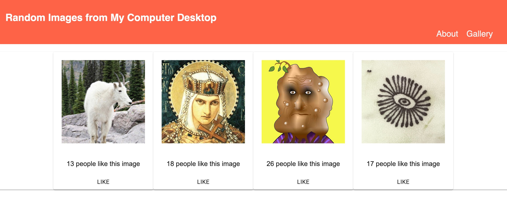

# React Gallery

This app provides a simple interface for rating and viewing images that are found on my desktop.

## How To Run It
After forking the code, the user must run `npm install` to install all dependencies. They may also have to run `npm install pg` and `npm install @material-ui/core`. 

A database, called `react_gallery`, must be created. All the SQL code to do so may be copied and pasted from the `database.sql` file.

Then, to run the application, use two terminal windows to start the server and client side with `npm run server` and `npm run client` respectively.

## How It Works

All images initially load with no likes. When a user clicks the image, the text description is displayed. When the like button is clicked, the like counter increments upwards. 

I hope you like this collection of random images!
